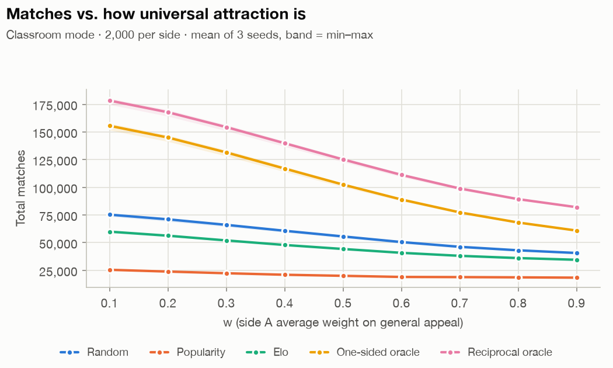
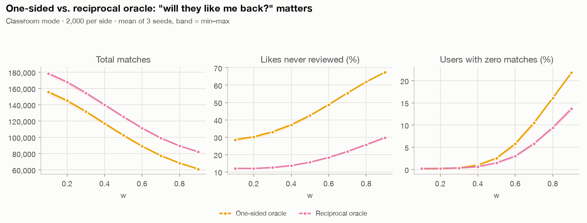
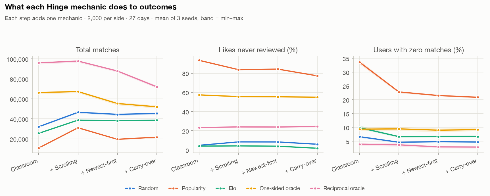
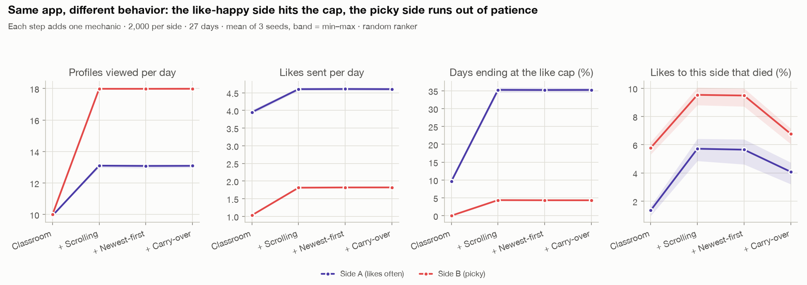
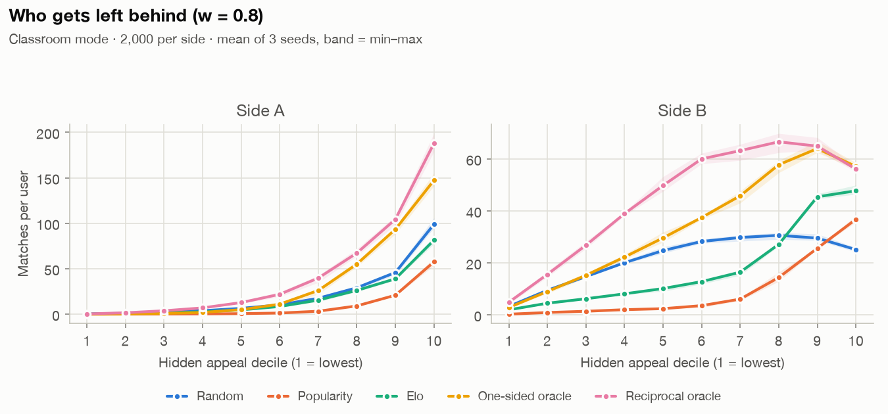

# dating-market-sim

A simulated two-sided dating market where every person's true preferences are known. Because
the ground truth is known, you can:

- run any ranking algorithm and see how the whole market reacts, which a static dataset can't do
- measure how well a learned model recovers the true preferences
- compare every algorithm against perfect-information reference points

The problem splits into two halves, built separately:

1. **Preference estimation:** who likes whom? (Elo, matrix factorization, a reciprocal two-tower)
2. **Ranking and market design:** given those estimates, what does each person see? (naive,
   reciprocal product, TU, MODE)

The full plan is in [`dating-market-simulator.md`](dating-market-simulator.md).

## Roadmap

| Phase | What | Status |
|---|---|---|
| 1 | Simulator (classroom mode, then Hinge mode) plus random, popularity, Elo, one-sided and reciprocal oracles, and Gale-Shapley | **Done** |
| 2 | Reproduce MODE's synthetic experiment, then run MODE inside the simulator | Next |
| 3 | Matrix factorization per direction, to estimate preferences from logs | Planned |
| 4 | Hinge-style reciprocal two-tower in PyTorch | Planned |

How Phase 1 was built, step by step and with the reasoning, is in
[`notes/build-log.md`](notes/build-log.md).

## How the market works

There are two sides, A and B. `P[a, b]` is the chance A likes B, and `Q[b, a]` is the chance B
likes A. Each person's score for someone mixes general appeal `u` (hidden) with fit to their
own type (based on displayed traits). The weight `w` sets the mix: high `w` means everyone
wants the same people. Side A likes often and leans on looks; side B is picky.

Every day:

1. **Inbox review.** Each person reads incoming likes up to an attention budget (5 to 15) and
   likes back according to their true preference. A like-back is a match, and liking back is
   free.
2. **Browse.** A ranker picks each person's list. They swipe until the list ends, they've used
   their 8 daily likes, or they lose patience.
3. **Night.** Today's likes arrive in tomorrow's inboxes.

The two modes:

| | Classroom mode | Hinge mode |
|---|---|---|
| Browsing | 10 profiles a day | scroll up to 50, with a 5% chance of quitting after each profile |
| Inbox order | best match first | newest first |
| Unread likes | vanish overnight | stay forever |

## Rankers

| Ranker | Shows you... |
|---|---|
| Random | a fresh random order (the floor) |
| Popularity | the most-liked people first |
| Elo | people at a similar rating percentile on their own side |
| One-sided oracle | who you'd like most (true `P`) |
| Reciprocal oracle | who you'd most likely match with (true `P × Q`) |
| Gale-Shapley | one stable-matching partner a day (a top pick) |

The oracles read the true preferences. They're reference points, not something an app could
run.

## Phase 1 results







1. **Asking "will they like me back?" is worth about 25% more matches and halves the dead
   likes.** At 2,000 per side, classroom mode, w = 0.6: the reciprocal oracle makes 111,263
   matches vs. 89,018 for the one-sided oracle, and 18% of its likes die unread vs. 49%.
   Showing people who *you* like most sends everyone to the same few inboxes.
2. **Congestion beats compatibility.** Popularity ranking does worse than random (19,050 vs.
   50,581 matches) because 92% of its likes die in overflowing inboxes. In Hinge mode, the
   rankers that herd lose the most (reciprocal −35%, one-sided −42%, random −10%). With
   carry-over and newest-first, a like stuck unread in a flooded inbox also hides that pair
   from each other's feeds.
3. **Better pairs per impression can still mean fewer matches.** Elo and Gale-Shapley both show
   pairs with better match odds than random, but their neighbourhoods are symmetric (if A is
   shown B, B is shown A), so they cover fewer distinct pairs. Elo lands below random, and
   Gale-Shapley's top pick makes about a third as many matches as the reciprocal top-1. Across
   every ranker, matches ≈ the sum of `P × Q` over the distinct pairs shown, minus what
   congestion eats.

Nobody coded the sides' behaviour, but in Hinge mode it emerges anyway. Side A ends 35% of its
days at the like cap. Side B scrolls further (18 vs. 13 profiles a day), quits from boredom,
and sends far fewer likes.

The ranker order is the same at 500, 1,000 and 2,000 per side, in both modes.

### Limitations

- Opposite-side matching only, and everyone is active every day.
- Preferences are fixed for the whole run: nobody gets pickier as they get more likes.
- Every number is a placeholder until it's calibrated against real data. The fitness and
  ambition weights were scaled down 4× from the plan, so that `w` really controls how
  universal attraction is (build log, step 2).
- Each person's answer about each other person is drawn once, so a second look never changes
  the decision. There's no mood noise.
- Days run in synchronized rounds (everyone reviews, then everyone browses).

## Run it

```bash
uv sync
uv run pytest                                            # 91 tests, ~3 s
uv run python experiments/01_baselines_sweep.py          # both modes, 500/side, ~4 s
uv run python experiments/01_baselines_sweep.py --n 2000 # final numbers, ~2 min on 14 cores
uv run python experiments/01b_hinge_mode.py --n 2000     # add Hinge mechanics one at a time
uv run python experiments/01c_scale_check.py             # 500 / 1,000 / 2,000 per side
uv run python experiments/01d_top_pick.py                # Gale-Shapley as a daily top pick
uv run ruff check .
```

Charts and their CSV twins go to `results/n<size>/`. Seeds are fixed, so every result
regenerates exactly.

## Layout

```
sim/
  config.py       every number, per side, plus the classroom and Hinge presets
  population.py   generate people: hidden appeal, traits, ideals, pickiness, attention
  preferences.py  true P and Q, calibrated like-rates, pre-drawn decisions
  market.py       the daily loop and the event log
  metrics.py      matches, Gini, dead likes, zero-match share, appeal deciles
  runner.py       parallel sweeps
  plots.py        shared chart style
rankers/          random, popularity, oracles, Elo, Gale-Shapley
experiments/      01 sweep, 01b Hinge stages, 01c scale check, 01d top pick
tests/            invariants and sanity checks from the plan
results/          charts and CSVs
notes/            the build log
```

## License

MIT
